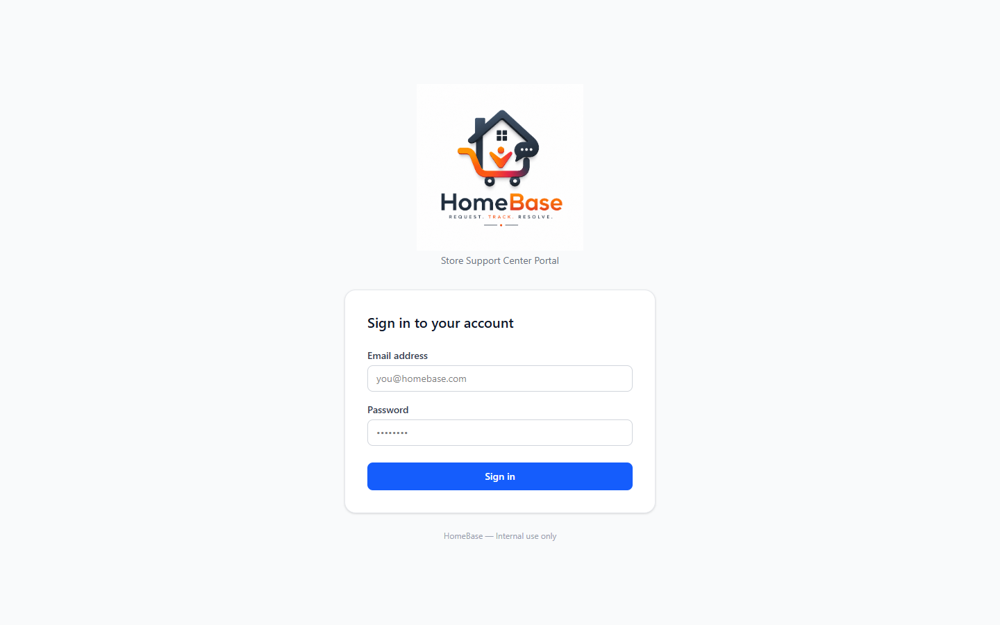
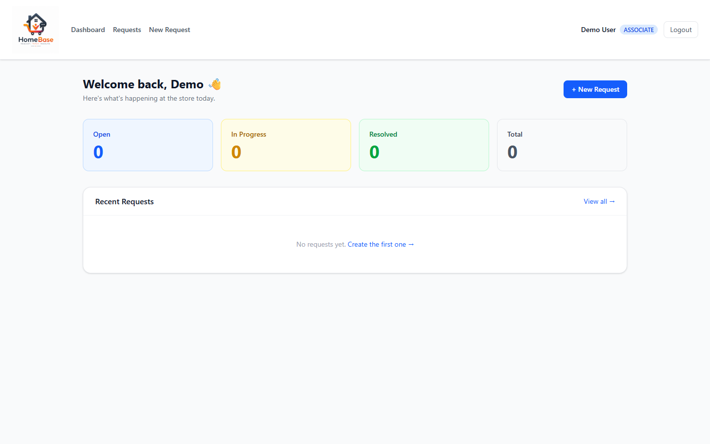
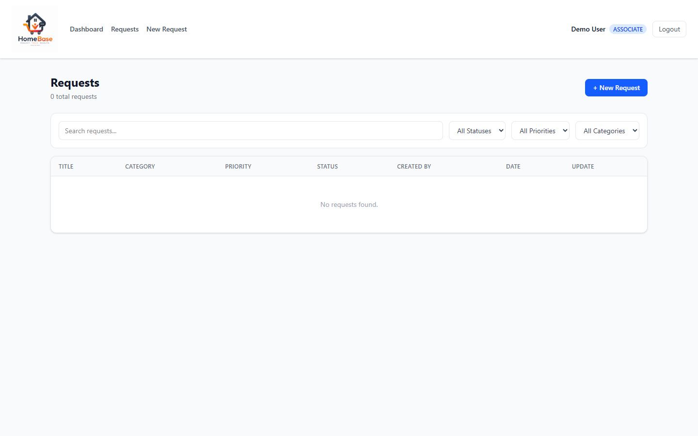
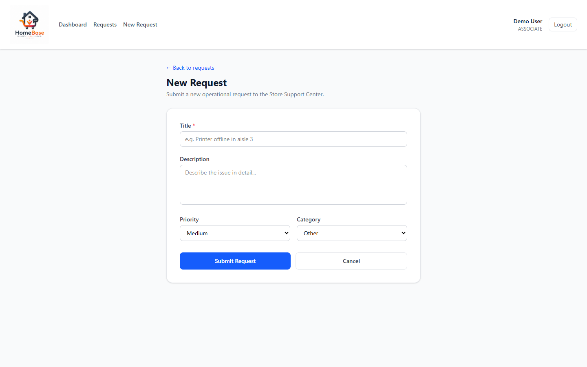
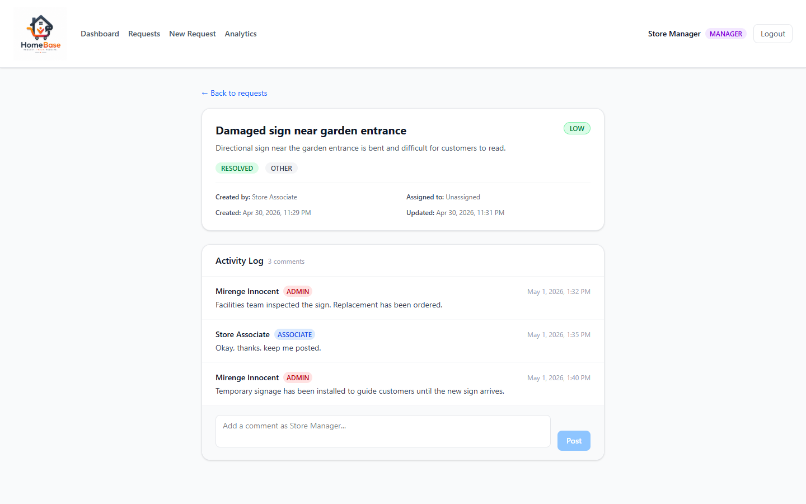
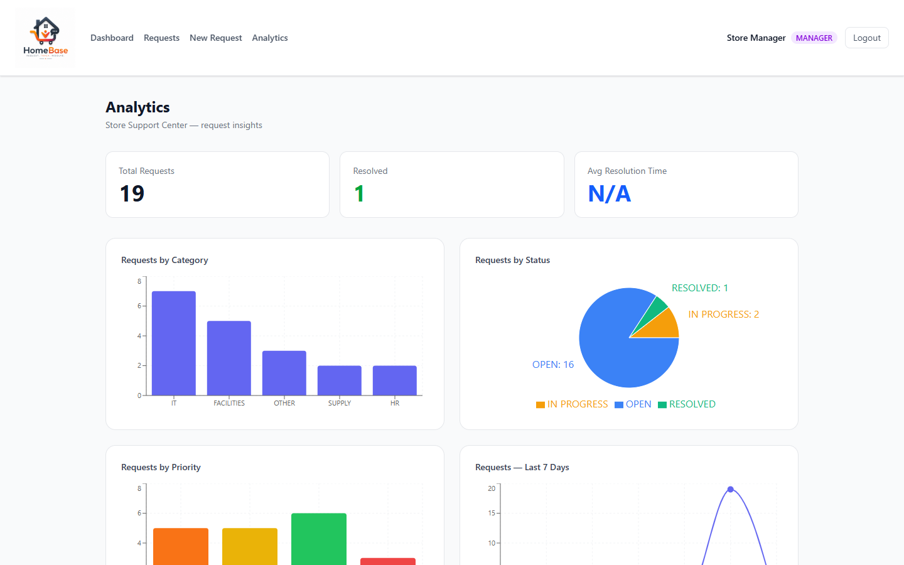

# HomeBase — Frontend

React + TypeScript SPA for the HomeBase Store Support Center Portal.

---

## Overview

The frontend is a single-page application built with React 19, TypeScript, Vite, and Tailwind CSS. It communicates with the Spring Boot backend at `http://localhost:8080` via Axios, enforces role-based UI visibility, and manages authentication state globally with React Context + localStorage.

---

## Screenshots

| Login | Dashboard |
|---|---|
|  |  |

| Request List | New Request |
|---|---|
|  |  |

| Request Detail & Activity Log | Analytics Dashboard |
|---|---|
|  |  |

---

## Tech Stack

| Tool | Purpose | Version |
|---|---|---|
| React | UI framework | 19.2 |
| TypeScript | Type safety | ~6.0 |
| Vite | Build tool and dev server | 8.x |
| Tailwind CSS | Utility-first styling | 4.x |
| Recharts | Charts (bar, pie, line) | 3.x |
| Axios | HTTP client | 1.7 |
| React Router | Client-side routing | v7 |

---

## Pages

| Route | Page | Description | Access |
|---|---|---|---|
| `/login` | `LoginPage` | Email + password sign-in form with HomeBase branding | Public |
| `/dashboard` | `DashboardPage` | Summary cards (Open / In Progress / Resolved / Total) + recent requests | All roles |
| `/requests` | `RequestListPage` | Paginated table with keyword search, status/priority/category filters, inline status updates | All roles (Associates see own requests only) |
| `/requests/:id` | `RequestDetailPage` | Full request view — metadata, status/priority badges, threaded activity log, add comment | All roles |
| `/requests/new` | `CreateRequestPage` | Form to submit a new request — title, description, priority, category | All roles |
| `/analytics` | `AnalyticsPage` | Bar/pie/line charts — category, status, priority, 7-day trend, avg resolution time | MANAGER / ADMIN only |

---

## Components

| Component | Description |
|---|---|
| `Navbar` | Top nav — links to Dashboard, Requests, New Request, Analytics (MANAGER/ADMIN only); shows user name with color-coded role badge (red=ADMIN, purple=MANAGER, blue=ASSOCIATE); Logout button |
| `SummaryCard` | Dashboard stat card — label + count with color-coded border |
| `PriorityBadge` | Colored pill badge for CRITICAL / HIGH / MEDIUM / LOW |
| `RequestRow` | Table row for a single request — title is a clickable link to the detail page; status dropdown is disabled for ASSOCIATE (shows "View only") |

---

## Project Structure

```
src/
├── api/
│   ├── axios.ts          # Axios instance — base URL + Authorization header injection
│   ├── requests.ts       # Typed API functions: createRequest, getRequests, updateRequest, deleteRequest, getSummary
│   ├── comments.ts       # getComments(requestId), addComment(requestId, body)
│   └── analytics.ts      # getAnalyticsSummary() — ChartEntry and AnalyticsSummary types
├── components/
│   ├── Navbar.tsx         # Role-aware nav with colored role badge + Analytics link
│   ├── PriorityBadge.tsx
│   ├── SummaryCard.tsx
│   └── RequestRow.tsx     # Clickable title link; RBAC-conditional status dropdown
├── context/
│   └── AuthContext.tsx    # Global auth state — user, token, login(), logout()
├── pages/
│   ├── LoginPage.tsx
│   ├── DashboardPage.tsx
│   ├── RequestListPage.tsx
│   ├── RequestDetailPage.tsx  # Request metadata + activity log + add comment
│   ├── CreateRequestPage.tsx
│   └── AnalyticsPage.tsx      # Recharts bar/pie/line; MANAGER/ADMIN only
├── types/
│   └── index.ts           # TypeScript interfaces: User, Request, Comment, RequestSummary, AnalyticsSummary, etc.
├── App.tsx                # Route definitions with protected route guard
└── main.tsx               # App entry point
```

---

## Auth Flow

1. User submits email + password on `/login`
2. `AuthContext.login()` calls `POST /api/auth/login`
3. On success, `accessToken` and user info are stored in `localStorage`
4. Axios interceptor reads the token from `localStorage` and injects `Authorization: Bearer <token>` on every request
5. `App.tsx` wraps protected routes in a guard that redirects unauthenticated users to `/login`
6. `AnalyticsPage` additionally checks `user.role` and redirects non-MANAGER/ADMIN users to `/dashboard`
7. `AuthContext.logout()` clears `localStorage` and redirects to `/login`

---

## RBAC in the UI

| UI Element | ASSOCIATE | MANAGER | ADMIN |
|---|---|---|---|
| Analytics nav link | Hidden | Visible | Visible |
| Request list | Own requests only | All requests | All requests |
| Status update dropdown | Disabled ("View only") | Enabled | Enabled |
| Analytics page | Redirected to dashboard | Full access | Full access |
| Role badge color | Blue | Purple | Red |

---

## Setup

### Prerequisites
- Node.js 18+
- Backend API running at `http://localhost:8080`

### Install and run

```bash
npm install
npm run dev
```

App runs at `http://localhost:5173`.

### Other scripts

| Script | Description |
|---|---|
| `npm run dev` | Start development server with HMR |
| `npm run build` | Production build to `dist/` |
| `npm run preview` | Preview production build locally |
| `npm run lint` | Run ESLint |

---

## Environment

The backend URL is hardcoded in `src/api/axios.ts` as `http://localhost:8080`. To point at a different API, update that base URL before building.

---

## Author

**Mirenge Innocent**
M.S. Computer Science — Georgia State University
[LinkedIn](https://www.linkedin.com/in/mirenge-innocent-799bb6300/) | [GitHub](https://github.com/minnocent12)
