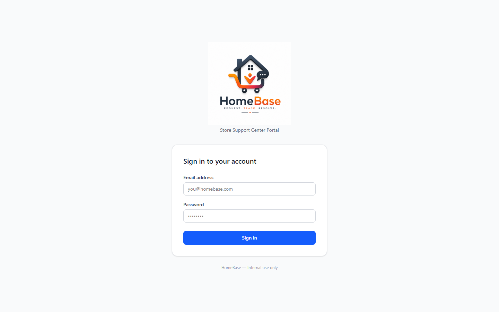
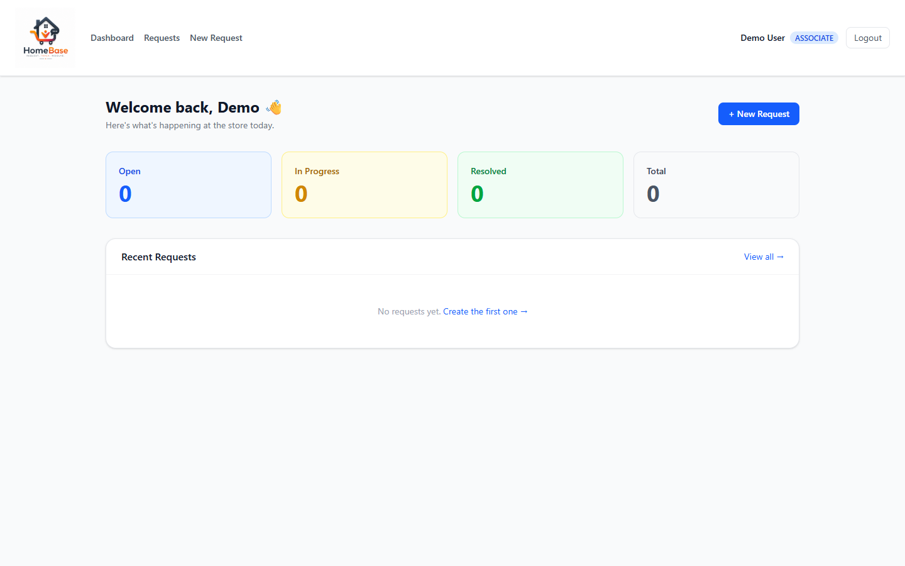
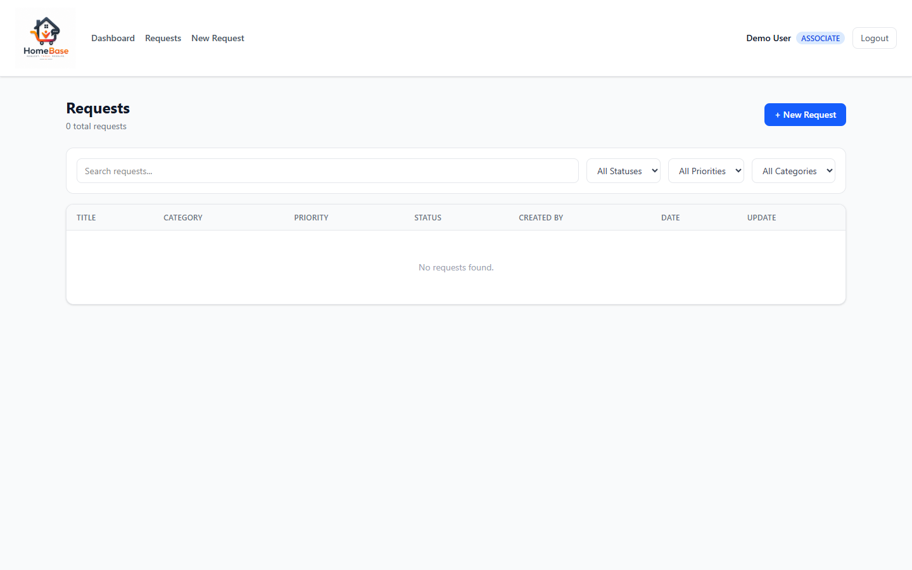
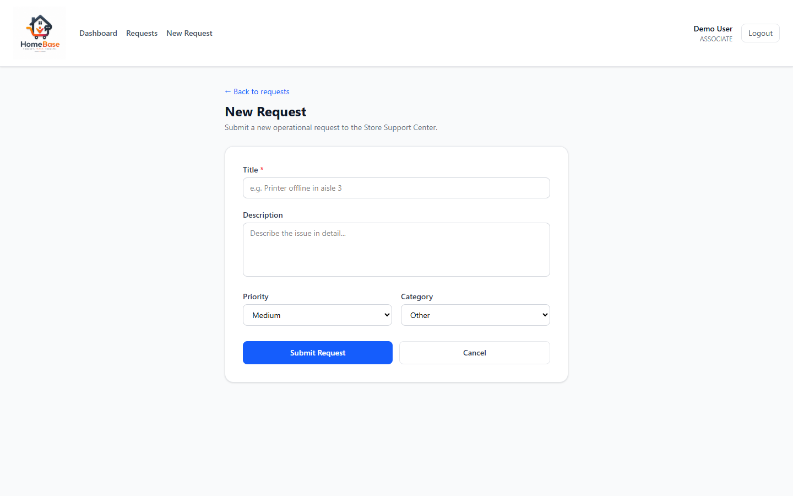
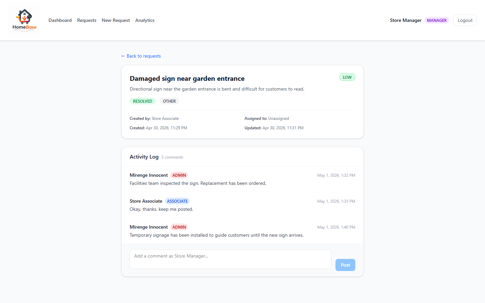
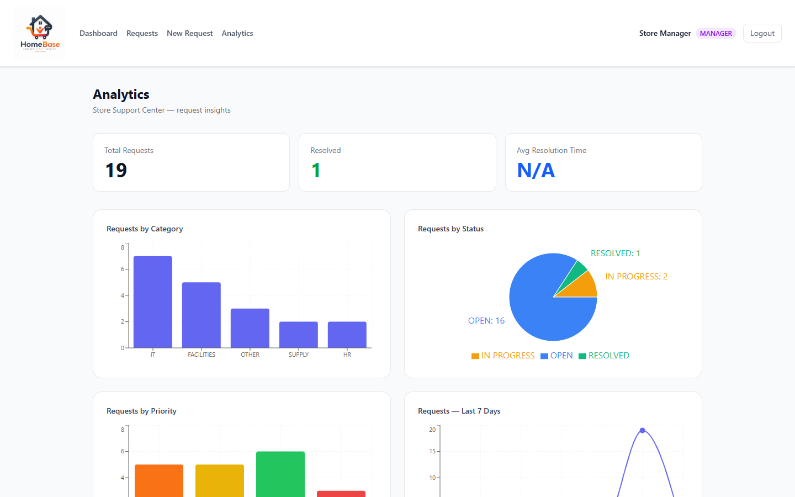

# HomeBase — Frontend

React + TypeScript SPA for the HomeBase Store Support Center Portal.

---

## Live Deployment

| Environment | URL |
|---|---|
| Production (AWS) | http://homebase-alb-2128858486.us-east-2.elb.amazonaws.com |
| Local (Docker) | http://localhost |
| Local (Dev) | http://localhost:5173 |

---

## Overview

The frontend is a single-page application built with React 19, TypeScript, Vite, and Tailwind CSS. It communicates with the Spring Boot backend via relative `/api/` paths — proxied to the backend by nginx (Docker/AWS) or Vite's dev proxy (local). Auth state (including the user's role and team) is managed globally with React Context + localStorage.

---

## Screenshots

| Login | Dashboard |
|---|---|
|  |  |

| Request List | New Request |
|---|---|
|  |  |

| Request Detail & Activity Log | Analytics Dashboard |
|---|---|
|  |  |

---

## Tech Stack

| Tool | Purpose | Version |
|---|---|---|
| React | UI framework | 19.2 |
| TypeScript | Type safety | ~6.0 |
| Vite | Build tool and dev server | 8.x |
| Tailwind CSS | Utility-first styling | 4.x |
| Recharts | Charts (bar, pie, line) | 3.x |
| Axios | HTTP client | 1.7 |
| React Router | Client-side routing | v7 |

---

## Pages

| Route | Page | Description | Access |
|---|---|---|---|
| `/login` | `LoginPage` | Email + password sign-in form | Public |
| `/dashboard` | `DashboardPage` | Summary cards (Open / In Progress / Resolved / Total) + recent requests | All roles |
| `/requests` | `RequestListPage` | Paginated request table; keyword, status, priority filters; TECHNICIAN gets a three-tab work queue | All roles |
| `/requests/:id` | `RequestDetailPage` | Full request view — metadata, badges, threaded activity timeline (status changes + comments merged chronologically) | All roles |
| `/requests/new` | `CreateRequestPage` | Form to submit a new request — title, description, priority, category | All roles |
| `/analytics` | `AnalyticsPage` | Bar/pie/line charts — category, status, priority, 7-day trend, avg resolution time | MANAGER / ADMIN only |
| `/users` | `UserManagementPage` | User table with search, role, and team filters; create user modal | MANAGER / ADMIN only |
| `/admin/teams` | `TeamManagementPage` | Team cards showing members; add/remove member controls; unassigned users panel | ADMIN only |

---

## Components

| Component | Description |
|---|---|
| `Navbar` | Top nav — role-aware links: Dashboard, Requests, New Request always visible; Analytics + Users for MANAGER/ADMIN; Teams for ADMIN only; color-coded role badge (red=ADMIN, purple=MANAGER, teal=TECHNICIAN, blue=ASSOCIATE); Logout |
| `SummaryCard` | Dashboard stat card — label + count with color-coded border |
| `PriorityBadge` | Colored pill badge for CRITICAL / HIGH / MEDIUM / LOW |
| `RequestRow` | Table row — MANAGER/ADMIN: status + assignee dropdowns; TECHNICIAN: "Pick up" button (unassigned, not own) or teal status dropdown (assigned to me) or "Assigned" read-only; ASSOCIATE: "View only" |

---

## Technician Work Queue

When a TECHNICIAN visits `/requests`, the standard filter bar is replaced by a three-tab interface:

| Tab | What it shows |
|---|---|
| **Team Queue** | Unassigned requests in the technician's team that they did not create — available to pick up |
| **My Work** | Requests currently assigned to the technician |
| **My Submissions** | Requests the technician created themselves |

Each tab shows a live count badge. The category filter is hidden for technicians (their team already scopes the category). Clicking "Pick up" on a Team Queue request self-assigns it and moves it to My Work.

---

## Project Structure

```
src/
├── api/
│   ├── axios.ts          # Axios instance — relative baseURL + Authorization header injection
│   ├── requests.ts       # createRequest, getRequests, getRequestById, updateRequest,
│   │                     #   deleteRequest, getSummary, getStatusHistory
│   ├── comments.ts       # getComments(requestId), addComment(requestId, body)
│   ├── analytics.ts      # getAnalyticsSummary()
│   ├── users.ts          # getUsers(), createUser(payload)
│   └── teams.ts          # getTeams(), addMember(teamId, userId), removeMember(teamId, userId)
├── components/
│   ├── Navbar.tsx         # Role-aware nav with colored role badge
│   ├── PriorityBadge.tsx
│   ├── SummaryCard.tsx
│   └── RequestRow.tsx     # RBAC-conditional action cell — full details in Components above
├── context/
│   └── AuthContext.tsx    # Global auth state — user (includes teamId, teamName), login(), logout(), refreshSession()
├── pages/
│   ├── LoginPage.tsx
│   ├── DashboardPage.tsx
│   ├── RequestListPage.tsx        # Three-tab view for TECHNICIAN; standard filters for others
│   ├── RequestDetailPage.tsx      # Metadata + merged activity timeline + add comment
│   ├── CreateRequestPage.tsx
│   ├── AnalyticsPage.tsx          # Recharts; MANAGER/ADMIN only
│   ├── UserManagementPage.tsx     # User table + CreateUserModal; MANAGER/ADMIN
│   └── TeamManagementPage.tsx     # Team cards + member management; ADMIN only
├── types/
│   └── index.ts           # AuthResponse, Request, UserSummary, Team, Comment,
│                          #   StatusHistoryEntry, DashboardSummary, Page<T>, etc.
├── App.tsx                # Route definitions with protected route guard
└── main.tsx               # App entry point
```

---

## Auth Flow

1. User submits email + password on `/login`
2. `AuthContext.login()` calls `POST /api/auth/login`
3. On success, `accessToken`, `refreshToken`, and full user info (including `teamId`, `teamName`, `role`) are stored in `localStorage`
4. Axios interceptor reads the token from `localStorage` and injects `Authorization: Bearer <token>` on every request
5. `App.tsx` wraps protected routes in a guard that redirects unauthenticated users to `/login`
6. Role-gated pages (`AnalyticsPage`, `UserManagementPage`, `TeamManagementPage`) additionally check `user.role` and redirect unauthorized users to `/dashboard`
7. `AuthContext.refreshSession()` silently exchanges the stored refresh token for a new access token on 401 responses
8. `AuthContext.logout()` clears `localStorage` and redirects to `/login`

---

## RBAC in the UI

| UI Element | ASSOCIATE | TECHNICIAN | MANAGER | ADMIN |
|---|---|---|---|---|
| Analytics nav link | Hidden | Hidden | Visible | Visible |
| Users nav link | Hidden | Hidden | Visible | Visible |
| Teams nav link | Hidden | Hidden | Hidden | Visible |
| Request list view | Own requests | Team + assigned + own (3 tabs) | All requests | All requests |
| Category filter | Visible | Hidden | Visible | Visible |
| Status update | "View only" | Own assigned (teal dropdown) | Full dropdown | Full dropdown |
| Pick up button | No | Yes (unassigned team requests) | No | No |
| Assign dropdown | No | No | Yes | Yes |
| User management page | Blocked | Blocked | Own team Associates | All users |
| Team management page | Blocked | Blocked | Blocked | Full access |
| Role badge color | Blue | Teal | Purple | Red |

---

## Setup

### Option 1 — Docker (recommended)

From the repo root — runs PostgreSQL, backend, and frontend together:

```bash
docker-compose up --build
```

App available at `http://localhost`. The frontend image uses a multi-stage Dockerfile: Node builds the Vite bundle in a `node:20-alpine` stage, then the static files are served by `nginx:alpine`. The included `nginx.conf` handles SPA routing (`try_files`) and proxies all `/api/` traffic to the backend.

### Option 2 — Local development

#### Prerequisites
- Node.js 18+
- Backend API running at `http://localhost:8080`

#### Install and run

```powershell
# Windows — from the repo root (installs on first run only)
.\run-frontend.ps1
```

```bash
# macOS / Linux
npm install  # first time only
npm run dev
```

App runs at `http://localhost:5173`.

### Other scripts

| Script | Description |
|---|---|
| `npm run dev` | Start development server with HMR |
| `npm run build` | Production build to `dist/` |
| `npm run preview` | Preview production build locally |
| `npm run lint` | Run ESLint |

---

## Environment

The Axios instance in [src/api/axios.ts](src/api/axios.ts) uses an empty string `''` as `baseURL`, so all API calls use relative paths (e.g. `/api/auth/login`).

- **Local dev** — Vite's dev server proxies `/api/` to `http://localhost:8080` (configured in `vite.config.ts`)
- **Docker / AWS** — nginx proxies `/api/` to the backend container (Docker Compose: `backend:8080`; AWS: ALB DNS name via VPC resolver)

---

## Author

**Mirenge Innocent**
M.S. Computer Science — Georgia State University
[LinkedIn](https://www.linkedin.com/in/mirenge-innocent-799bb6300/) | [GitHub](https://github.com/minnocent12)
